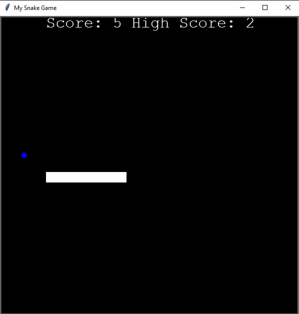

# **Snake Game**

A classic Snake game implementation using Python's Turtle graphics module.

## 🎮 Game Description

The Snake game is a timeless classic where players control a snake, guiding it to eat food while avoiding collisions with walls and its own tail. As the snake consumes food, it grows longer, making the game more challenging.

## 🚀 Features

- 🎮 Responsive Controls: Control the snake's movement using the arrow keys.
- 🍎 Food: The snake must eat food (blue circles) to increase its length and earn points.
- 💥 Collision Detection: Collisions with walls or the snake's own tail result in game over.
- 🏆 Scoreboard: View the current score and the highest score achieved on the screen.
- 💾 High Score Persistence: The highest score is saved and loaded from a file.

## 🎯 How to Play

1. 🐍 Install Python on your system (if not already installed).
2. 🔽 Clone the repository or download the source code files.
3. 💻 Open the terminal or command prompt and navigate to the project directory.
4. ⬇️ Install the required dependencies by running the following command:
5. 🎮 Run the game by executing the `main.py` file.
6. 🎮 Use the arrow keys (up, down, left, right) to control the snake's movement.
7. 🐍 The snake will automatically start moving at the beginning.
8. 🍎 Guide the snake to eat the food and avoid collisions with walls or its own tail.
9. 💥 The game ends when the snake collides with a wall or its own tail.
10. ⭐️ Your highest score will be automatically saved.

## ⚙️ Customization

- You can customize various aspects of the game to suit your preferences:
- Adjust the window size and background color in the `main.py` file.
- Modify the appearance of the snake, food, and scoreboard in their respective Python files.
- Change the speed and delay between snake movements by adjusting the `time.sleep()` value in the game loop.

